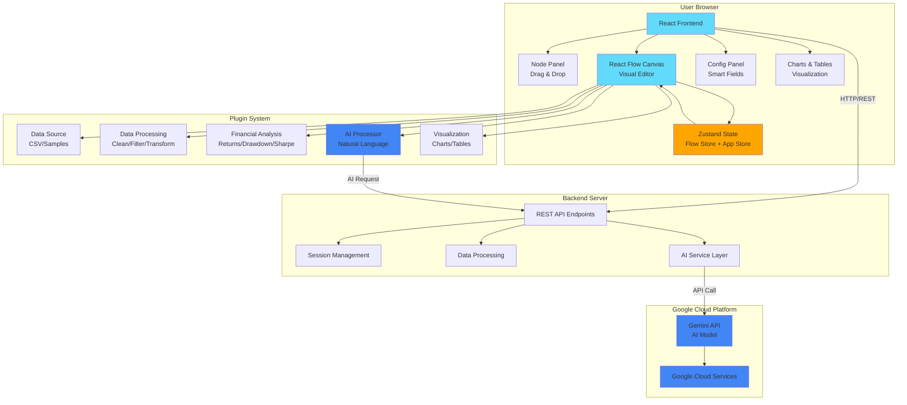
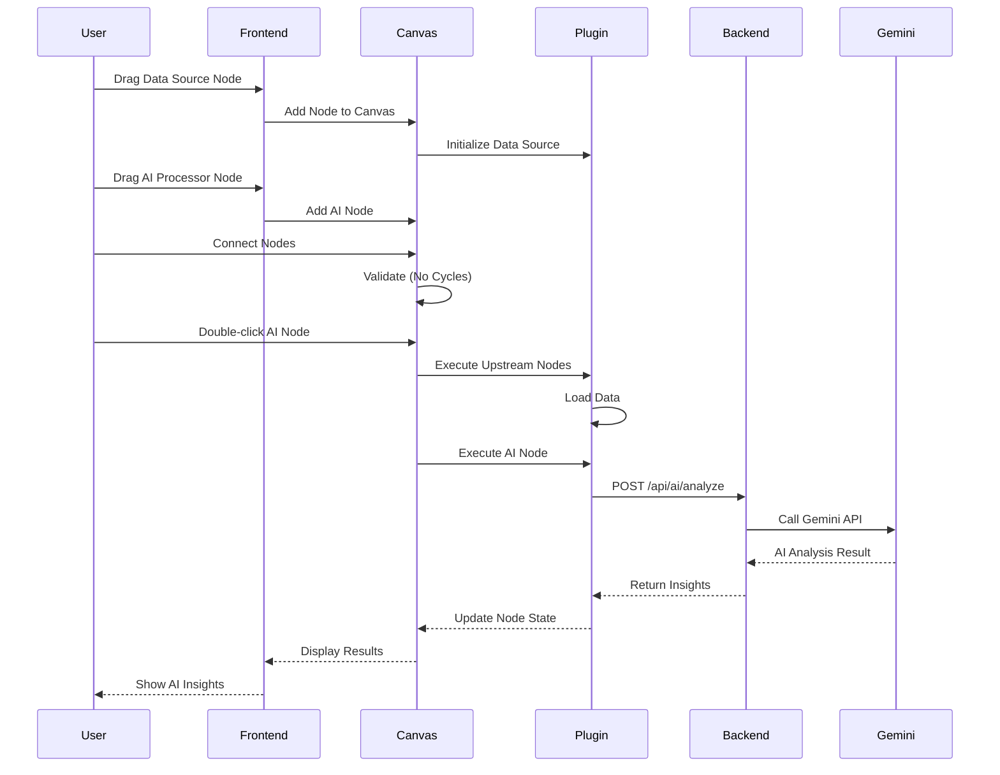
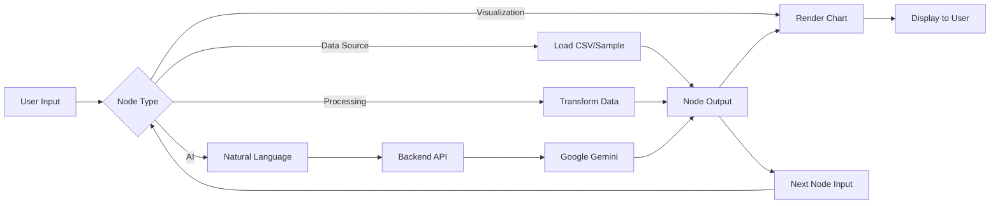
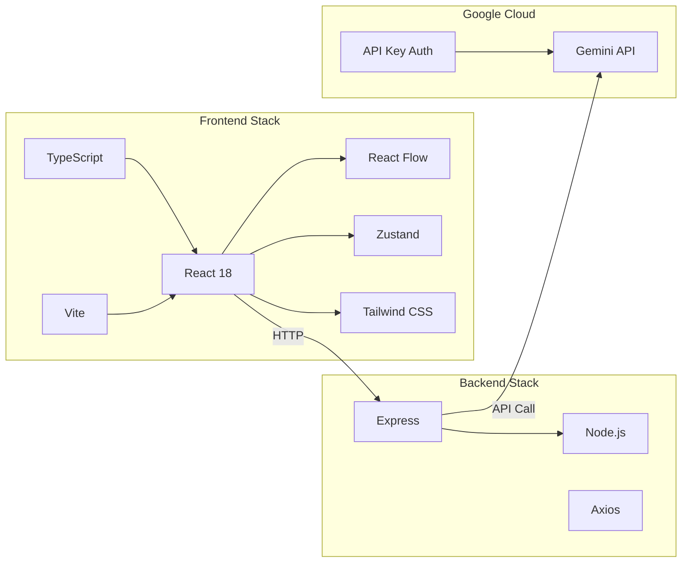
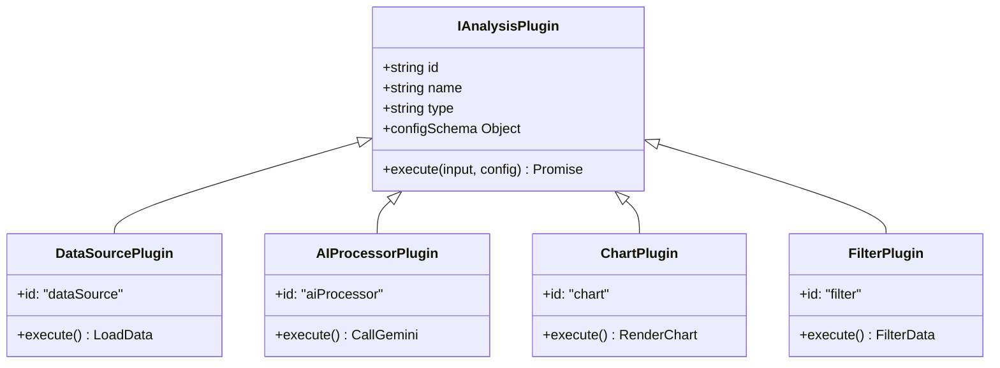
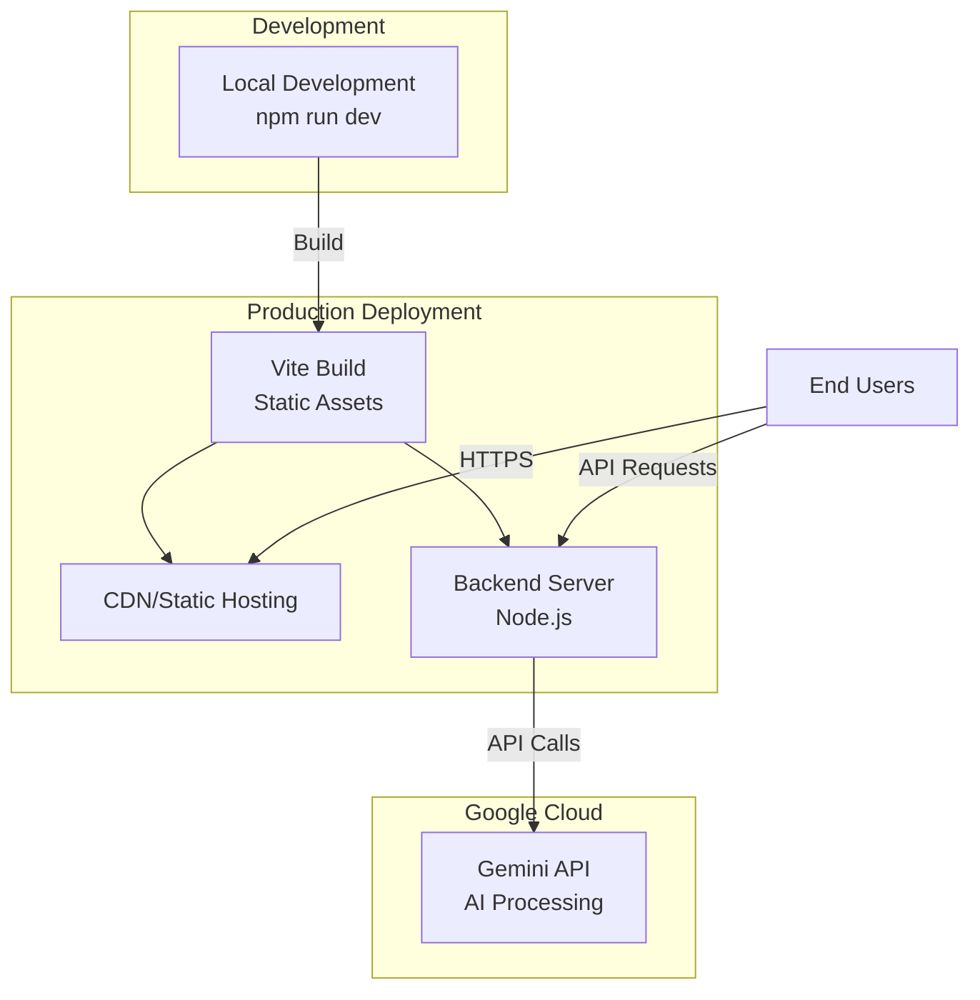

# LiveData OS - System Architecture Diagram

## Visual Architecture (Mermaid Diagram)

Copy this code to any Mermaid renderer (GitHub, Mermaid Live Editor, etc.)

## Detailed Component Interaction

## Data Flow Architecture

## Technology Stack Diagram

## Plugin Architecture

## Deployment Architecture

---

**Note**: These diagrams can be rendered on:
- GitHub (native Mermaid support)
- [Mermaid Live Editor](https://mermaid.live)
- VS Code with Mermaid extension
- Documentation sites (GitBook, Docusaurus, etc.)
